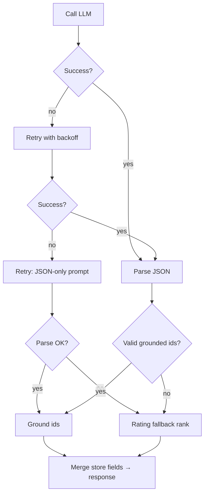

# Edge Cases & Handling Guide

This document catalogs edge cases for the AI-powered restaurant recommendation system. Each entry defines the **scenario**, **expected behavior**, and **implementation guidance** aligned with [`context.md`](context.md), [`architecture.md`](architecture.md), and [`implementation-plan.md`](implementation-plan.md).

Use this as a checklist during development and QA. Priority: **P0** (must handle before demo), **P1** (should handle for MVP), **P2** (nice-to-have / post-MVP).

---

## How to Read This Document

| Column | Meaning |
|--------|---------|
| **ID** | Stable reference (e.g. `VAL-03`) |
| **Priority** | P0 / P1 / P2 |
| **Layer** | Where the case is detected or handled |
| **Behavior** | What the system must do |
| **Test hint** | Suggested unit/integration test |

---

## 1. Data Ingestion & Dataset Quality

| ID | Scenario | Priority | Behavior | Test hint |
|----|----------|----------|----------|-------------|
| ING-01 | Hugging Face download fails (network, 404) | P0 | Exit ingest with non-zero code; log error; do not write partial corrupt file | Mock `load_dataset` failure |
| ING-02 | Dataset schema changes (column renamed/removed) | P0 | Fail ingest with explicit "unknown column" message; document mapping in ingest script | Fixture with wrong schema |
| ING-03 | Empty dataset or zero rows after filters | P0 | Abort ingest; refuse app startup | Empty parquet |
| ING-04 | Missing `name` or `location` | P0 | Skip row; increment `skipped_count` in ingest summary | Row with null name |
| ING-05 | Missing or non-numeric `rating` | P1 | Skip row OR default to `null` and exclude from rating filter later | `"-"`, `""`, `N/A` |
| ING-06 | Rating out of range (e.g. &gt; 5 or negative) | P1 | Clamp to valid range or skip; log warning | `rating: 6.2` |
| ING-07 | Missing `estimated_cost_for_two` | P1 | Set `budget_band` to `unknown` or derive from median; exclude from budget filter unless band inferred | Null cost |
| ING-08 | Cost is string (`"₹800"`, `"800 for two"`) | P1 | Strip symbols; parse integer; on failure → null cost | Messy cost strings |
| ING-09 | Duplicate `(name, location)` | P1 | Keep highest-rated row or first seen; log duplicate count | Two identical rows |
| ING-10 | Cuisine field empty or `"nan"` | P1 | Set `cuisines: []`; may fail cuisine filter only | Empty cuisine |
| ING-11 | Cuisine as single string vs list | P1 | Split on comma/`|`; trim; dedupe tokens | `"Italian, Chinese"` |
| ING-12 | Location variants (`"Bengaluru"`, `"bangalore"`, `"Bangalore "`) | P0 | Normalize to canonical city key during ingest | Alias map in config |
| ING-13 | Extremely long text fields | P2 | Truncate for storage; do not send full text to LLM | 10k char description |
| ING-14 | Special characters / Unicode in names | P1 | Preserve UTF-8; no mangling in parquet/JSON | Emoji or Devanagari name |
| ING-15 | Partial ingest interrupted (disk full) | P1 | Write atomically (temp file → rename); delete incomplete on failure | Kill process mid-write |
| ING-16 | Re-run ingest on existing file | P2 | Overwrite or version by timestamp; document behavior | Run ingest twice |

**Ingest summary output (recommended):** `total_rows`, `ingested`, `skipped`, `duplicates_removed`, `cities_count`.

---

## 2. Restaurant Store

| ID | Scenario | Priority | Behavior | Test hint |
|----|----------|----------|----------|-------------|
| STO-01 | `data/restaurants.parquet` missing at startup | P0 | Fail fast with message: run `python scripts/ingest.py` | Delete parquet |
| STO-02 | Corrupt or truncated parquet file | P0 | Catch read error; refuse start; suggest re-ingest | Truncate file bytes |
| STO-03 | Parquet schema mismatch with app models | P0 | Version check or explicit column validation on load | Old parquet, new code |
| STO-04 | Store loads but zero restaurants | P0 | Same as ING-03; block app | Empty valid file |
| STO-05 | `get_by_id` for unknown id | P1 | Return `None`; orchestration must not crash | Random id |
| STO-06 | Case sensitivity in city queries | P0 | Query uses normalized `location` field | `"delhi"` vs `"Delhi"` |
| STO-07 | Memory pressure (very large dataset) | P2 | Prefer Parquet/SQLite over loading full CSV repeatedly; lazy load if needed | Large file benchmark |

---

## 3. User Input & Validation

| ID | Scenario | Priority | Behavior | Test hint |
|----|----------|----------|----------|-------------|
| VAL-01 | Empty or whitespace-only `location` | P0 | 400 / validation error: "Location is required" | `"   "` |
| VAL-02 | Unknown city (no match in store) | P0 | Reject with sample of supported cities (5–10), not full dump | `"Tokyo"` |
| VAL-03 | City typo close to valid (`"Banglore"`) | P1 | Fuzzy match if distance &lt; threshold; else suggest `"Bangalore"` | Levenshtein |
| VAL-04 | Invalid `budget` (not low/medium/high) | P0 | Reject: list allowed values | `"cheap"`, `""` |
| VAL-05 | `min_rating` negative or &gt; max in dataset | P0 | Reject or clamp with message | `-1`, `99` |
| VAL-06 | `min_rating` omitted | P0 | Treat as no floor (or sensible default e.g. 0) | `null` |
| VAL-07 | `cuisine` omitted | P0 | Do not apply cuisine filter | Optional field |
| VAL-08 | `cuisine` not in dataset vocabulary | P1 | Still apply filter → likely zero candidates; empty-state UX | `"Ethiopian"` in city with none |
| VAL-09 | `additional_preferences` empty list | P0 | Omit from prompt or pass as empty; no error | `[]` |
| VAL-10 | Very long `additional_preferences` text | P1 | Truncate to max chars (e.g. 500); sanitize | 5k character string |
| VAL-11 | Prompt injection in free text | P0 | Sanitize: strip control chars; wrap in delimiters; system prompt forbids obeying user commands to ignore rules | `"Ignore previous instructions..."` |
| VAL-12 | HTML/script in user input | P1 | Escape or strip tags before display in UI | `"<script>..."` |
| VAL-13 | All fields at extremes (strictest query) | P1 | Valid request; may yield zero candidates — not a validation error | 5.0 rating + niche cuisine |
| VAL-14 | Duplicate tags in `additional_preferences` | P2 | Dedupe case-insensitively | `["quick", "Quick"]` |
| VAL-15 | Non-JSON API body / wrong content-type | P1 | 400 with parse error | Malformed POST |

---

## 4. Filtering & Candidate Builder

| ID | Scenario | Priority | Behavior | Test hint |
|----|----------|----------|----------|-------------|
| FLT-01 | Zero restaurants match all filters | P0 | Return empty candidates; **do not call LLM**; return `suggestions` | Strict combo |
| FLT-02 | Matches exist but count &gt; `CANDIDATE_LIMIT` | P0 | Sort by rating desc; take top N | 500 matches |
| FLT-03 | Exactly one match | P0 | Send 1 candidate to LLM; return 1 recommendation | Single row |
| FLT-04 | All matches have same rating | P1 | Stable secondary sort (name asc) | Tie-break test |
| FLT-05 | Cuisine filter too strict (e.g. `"North Indian"` vs `"Indian"`) | P1 | Document token/substring rules; consider partial match config | Substring policy |
| FLT-06 | Budget band `unknown` on restaurant | P1 | Exclude from budget match OR include in all bands — **pick one policy and document** | Missing band |
| FLT-07 | User budget `low` but only `medium` restaurants in city | P0 | Empty result + suggest higher budget or different area | Data gap |
| FLT-08 | `min_rating` filters out entire city catalog | P1 | Empty state suggests lowering rating | `min_rating: 4.9` |
| FLT-09 | Location matches but wrong spelling in data only | P1 | Rely on ingest normalization (ING-12) | Pre-normalized store |
| FLT-10 | Optional cuisine + strict rating → 0 rows | P0 | Suggest dropping cuisine OR lowering rating | Combined empty |
| FLT-11 | Candidates &lt; `TOP_K` | P0 | Return fewer than K; LLM ranks all available | 2 candidates, K=5 |
| FLT-12 | Null rating in store row slipped through | P1 | Exclude from candidate set or treat as 0 | Data quality |

**Empty-state `suggestions` (recommended copy patterns):**

- Lower `min_rating` by 0.5
- Remove or broaden `cuisine`
- Try adjacent budget band
- Pick a nearby city from supported list

---

## 5. LLM & Prompt

| ID | Scenario | Priority | Behavior | Test hint |
|----|----------|----------|----------|-------------|
| LLM-01 | Missing `GROQ_API_KEY` (or provider key) | P0 | Startup or first-request error: clear env var instructions | Unset env |
| LLM-02 | Invalid API key (401) | P0 | User-safe message; log error code only | Bad key |
| LLM-03 | Rate limit (429) | P0 | Retry with exponential backoff (max 2–3); then friendly failure | Mock 429 |
| LLM-04 | Timeout | P0 | Retry once; then fallback or error message | Short timeout mock |
| LLM-05 | Provider 5xx | P0 | Same as LLM-03 | Mock 500 |
| LLM-06 | Empty model response | P1 | Retry once; then rating fallback | `""` response |
| LLM-07 | Response exceeds token limit (truncated JSON) | P0 | Detect parse failure → retry with "JSON only, shorter explanations" | Truncated fixture |
| LLM-08 | Model returns markdown-wrapped JSON | P0 | Parser strips ` ```json ` fences | Fenced JSON |
| LLM-09 | Model returns prose only (no JSON) | P0 | Retry; then heuristic rank by rating | Plain text |
| LLM-10 | Model returns invalid JSON (trailing comma, etc.) | P0 | `json_repair` or retry; then fallback | Broken JSON |
| LLM-11 | Model returns fewer than K recommendations | P1 | Return what was parsed; pad with rating fallback if needed | 2 of 5 |
| LLM-12 | Model returns more than K recommendations | P1 | Take first K after grounding | 10 ids |
| LLM-13 | Duplicate ranks or duplicate ids in response | P1 | Dedupe by id; re-rank sequentially | Duplicate ids |
| LLM-14 | Missing `summary` field | P2 | Omit summary in UI; not a failure | Partial JSON |
| LLM-15 | Missing `explanation` for one item | P1 | Default: "Matches your preferences based on rating and filters." | Null explanation |
| LLM-16 | Very large candidate payload | P1 | Respect `CANDIDATE_LIMIT`; truncate long fields in prompt | N=30 with long names |
| LLM-17 | Temperature / model misconfiguration | P2 | Load from config; validate model name at startup if API supports | Wrong model string |

---

## 6. Grounding & Hallucination Prevention

| ID | Scenario | Priority | Behavior | Test hint |
|----|----------|----------|----------|-------------|
| GRD-01 | LLM returns id not in candidate set | P0 | **Drop** recommendation; log `hallucinated_id` | Fake id in mock |
| GRD-02 | LLM invents restaurant name without valid id | P0 | Never display; only ids map to store rows | Name-only response |
| GRD-03 | LLM swaps rating/cost in explanation vs truth | P0 | UI shows rating/cost from **store only** | Wrong numbers in text |
| GRD-04 | LLM returns valid id but wrong rank order | P1 | Preserve LLM order unless `preference_matches` clearly wrong | Order assertion |
| GRD-05 | All LLM recommendations grounded but count = 0 after filter | P0 | Fall back to top-K by rating from candidates | All fake ids |
| GRD-06 | LLM recommends subset; user expects exactly K | P1 | Show available count: "3 recommendations (limited matches)" | 3 valid of K=5 |
| GRD-07 | Candidate id collision (ingest bug) | P1 | Ingest must prevent; if occurs, first match wins + log | Duplicate ids |

---

## 7. Orchestration & Service Layer

| ID | Scenario | Priority | Behavior | Test hint |
|----|----------|----------|----------|-------------|
| ORC-01 | Validation fails | P0 | Return error object; no store/LLM calls | Invalid budget |
| ORC-02 | Zero candidates | P0 | No LLM call; `candidate_count: 0`, `suggestions` | FLT-01 |
| ORC-03 | LLM fails after retries | P0 | Optional: rating-only fallback with banner "AI unavailable" | All retries fail |
| ORC-04 | Partial LLM success (some ids grounded) | P1 | Return partial list + note if &lt; K | Mix valid/invalid ids |
| ORC-05 | Concurrent requests (Streamlit rerun) | P2 | Stateless service; no shared mutable prefs | Double submit |
| ORC-06 | Exception in filter layer | P0 | Catch; log stack; user message "Something went wrong" | Forced exception |
| ORC-07 | Config missing `CANDIDATE_LIMIT` / `TOP_K` | P0 | Sensible defaults in code (e.g. 20, 5) | Empty settings |

---

## 8. Presentation Layer (UI)

| ID | Scenario | Priority | Behavior | Test hint |
|----|----------|----------|----------|-------------|
| UI-01 | User submits without required fields | P0 | Inline validation before API call | Empty form |
| UI-02 | Loading state during slow LLM | P0 | Spinner/skeleton; disable double-submit | Slow mock |
| UI-03 | Zero results screen | P0 | Show `suggestions`; no blank page | FLT-01 |
| UI-04 | `estimated_cost` null in store | P1 | Display "Not available" or budget band label | Null cost |
| UI-05 | Multiple cuisines display | P1 | Join with comma; max width with ellipsis | Long list |
| UI-06 | Very long AI explanation | P2 | Expand/collapse or max-height scroll | Long text |
| UI-07 | Error toast for API/validation failures | P0 | Show message; keep form values | 400 response |
| UI-08 | Session refresh mid-request | P2 | Idempotent; user can resubmit | Browser refresh |
| UI-09 | Mobile/narrow viewport | P2 | Cards stack; readable font sizes | Responsive check |

---

## 9. Configuration & Environment

| ID | Scenario | Priority | Behavior | Test hint |
|----|----------|----------|----------|-------------|
| CFG-01 | `settings.yaml` missing | P0 | Defaults + warning log | No file |
| CFG-02 | Invalid YAML | P0 | Fail startup with parse error | Malformed yaml |
| CFG-03 | `budget_bands.yaml` missing thresholds | P1 | Use architecture defaults (§5.4) | Empty bands |
| CFG-04 | Env override for `DATA_PATH` points to wrong file | P0 | Fail on load with path in message | Wrong path |
| CFG-05 | `TOP_K` &gt; `CANDIDATE_LIMIT` | P1 | Clamp K to candidate count at runtime | K=10, N=5 |
| CFG-06 | `CANDIDATE_LIMIT` = 0 or negative | P0 | Reject at config load | Invalid config |

---

## 10. Performance & Scale

| ID | Scenario | Priority | Behavior | Test hint |
|----|----------|----------|----------|-------------|
| PERF-01 | First request slow (cold start + load parquet) | P1 | Load store once at startup | Measure startup |
| PERF-02 | LLM latency &gt; 30s | P1 | Timeout + user message | Timeout config |
| PERF-03 | Repeated identical queries | P2 | Optional cache by hash(prefs + candidate ids) | Same submit twice |
| PERF-04 | Huge city (10k+ rows before cap) | P1 | Filter in memory or indexed store; always cap before LLM | Large city |

---

## 11. Security & Abuse

| ID | Scenario | Priority | Behavior | Test hint |
|----|----------|----------|----------|-------------|
| SEC-01 | Prompt injection via `additional_preferences` | P0 | Sanitize + system guardrails | VAL-11 |
| SEC-02 | Logging API keys | P0 | Never log env secrets | Log audit |
| SEC-03 | Public API without rate limit | P2 | Throttle per IP if exposing FastAPI | Burst requests |
| SEC-04 | User preferences in logs | P1 | Log hash or redact free text if policy requires | Privacy review |

---

## 12. Deployment & Operations

| ID | Scenario | Priority | Behavior | Test hint |
|----|----------|----------|----------|-------------|
| OPS-01 | Deploy without running ingest | P0 | Container entrypoint check for data file | Missing volume |
| OPS-02 | Stale dataset (old ingest) | P2 | Document refresh cadence; optional `ingested_at` in UI footer | Old timestamp |
| OPS-03 | Docker without network for LLM | P0 | Clear error when LLM unreachable | Offline container |
| OPS-04 | Clock skew affecting token expiry | P2 | NTP on host; standard SDK handling | Rare |

---

## Decision Policies (Ambiguous Cases)

Document these choices in code comments or `config/settings.yaml`:

| Topic | Recommended policy |
|-------|---------------------|
| Missing `budget_band` | Exclude from budget-filtered results (strict) **or** include in all bands (lenient) — **default: exclude** |
| Missing `min_rating` in request | No rating floor |
| Missing `cuisine` in request | Skip cuisine filter |
| LLM returns &lt; K valid rows | Show available; do not invent more |
| After all LLM ids rejected | Fallback: top K candidates by rating with generic explanation |
| City fuzzy match threshold | e.g. Levenshtein ratio ≥ 0.85 or single best match within distance 2 |
| Rating tie-break | Higher rating → then alphabetical name |

---

## Fallback Chain (LLM Failures)



| Step | Trigger | Action |
|------|---------|--------|
| 1 | 429 / 5xx / timeout | Backoff retry (max 2) |
| 2 | Unparseable JSON | One retry: "Respond with JSON only" |
| 3 | Still failing | Top-K by rating; explanation: generic template |
| 4 | All ids hallucinated | Same as step 3 |

---

## Error Response Shape (API / Service)

Consistent structure helps UI and tests:

```json
{
  "success": false,
  "error_code": "NO_CANDIDATES",
  "message": "No restaurants match your filters in Bangalore.",
  "suggestions": ["Try lowering minimum rating to 3.5", "Remove cuisine filter"],
  "details": {}
}
```

| `error_code` | When |
|--------------|------|
| `VALIDATION_ERROR` | Invalid preferences |
| `NO_CANDIDATES` | Filter returned empty |
| `DATA_UNAVAILABLE` | Store missing/corrupt |
| `LLM_UNAVAILABLE` | Provider down after retries |
| `INTERNAL_ERROR` | Unexpected exception |

---

## QA Matrix by Phase

| Implementation phase | Edge case IDs to verify |
|------------------------|-------------------------|
| Phase 1 | ING-01–16, STO-01–07 |
| Phase 2 | VAL-01–15 |
| Phase 3 | FLT-01–12 |
| Phase 4 | LLM-01–17, GRD-01–07 |
| Phase 5 | ORC-01–07 |
| Phase 6 | UI-01–09 |
| Phase 7 | All P0; sample of P1 |

---

## P0 Smoke Test Checklist (Pre-Demo)

- [ ] ING-01, STO-01: missing data fails clearly
- [ ] VAL-01, VAL-02, VAL-04: bad input rejected
- [ ] FLT-01: zero candidates, no LLM call
- [ ] GRD-01: fake id stripped
- [ ] LLM-01, LLM-04: key missing / timeout handled
- [ ] LLM-08, LLM-10: parser handles fenced/broken JSON
- [ ] UI-03, UI-07: empty and error states visible
- [ ] End-to-end happy path: Bangalore + medium + valid cuisine

---

## Traceability

| Source | Edge case coverage |
|--------|-------------------|
| `context.md` — grounded recommendations | GRD-01–07 |
| `context.md` — user preferences | VAL-01–15, FLT-* |
| `architecture.md` §9.2 | LLM-*, ORC-*, FLT-01 |
| `architecture.md` §6.1 | GRD-* |
| `implementation-plan.md` risk register | ING-02, FLT-01, GRD-01, LLM-01, ING-07 |

---

## References

- [`context.md`](context.md)
- [`architecture.md`](architecture.md)
- [`implementation-plan.md`](implementation-plan.md)
- [`Docs/problemstatement.txt`](Docs/problemstatement.txt)
