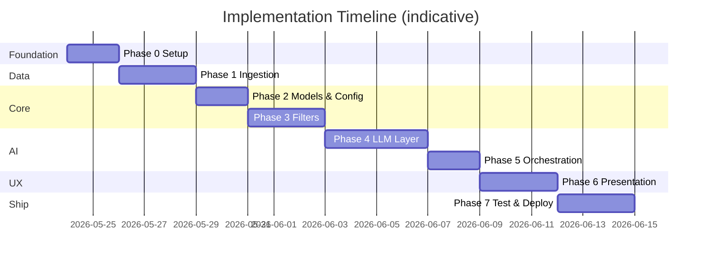
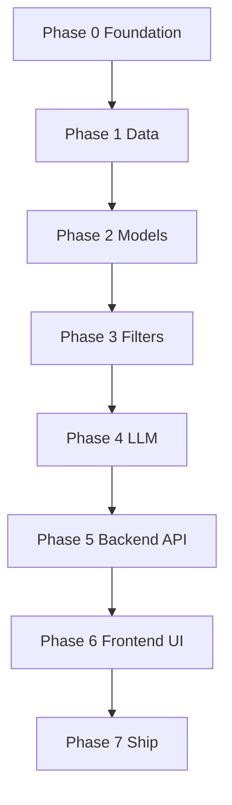

# Phase-Wise Implementation Plan

This plan breaks the AI-powered restaurant recommendation system into ordered phases. Each phase maps to [`context.md`](context.md) requirements and [`architecture.md`](architecture.md) components, with deliverables, tasks, acceptance criteria, and dependencies.

---

## Plan Overview

| Phase | Name | Primary outcome |
|-------|------|-----------------|
| **0** | Project foundation | Repo structure, dependencies, config, env template |
| **1** | Data ingestion & store | Clean `restaurants.parquet` (or SQLite) from Hugging Face |
| **2** | Domain models & validation | Typed models + preference validation |
| **3** | Filter & candidate builder | Deterministic shortlist for LLM |
| **4** | LLM recommendation engine | Prompt, adapter, parser, grounding |
| **5** | Application orchestration | End-to-end `recommend()` service |
| **6** | Presentation layer | User-facing UI with full output fields |
| **7** | Quality, docs & deployment | Tests, error paths, runbook, demo-ready app |

**Suggested stack (not mandated by context):** Python 3.11+, `datasets`, `pandas`/`pyarrow`, Pydantic, Streamlit or FastAPI, Groq LLM API.

---

## Phase 0: Project Foundation

**Goal:** Establish repository layout, tooling, and configuration so later phases plug in without rework.

**Architecture refs:** §7 (project structure), §9.1 (configuration)

### Tasks

| # | Task | Output |
|---|------|--------|
| 0.1 | Create folder structure per architecture §7 | `src/`, `scripts/`, `config/`, `data/`, `tests/` |
| 0.2 | Add `requirements.txt` or `pyproject.toml` | `datasets`, `pandas`, `pyarrow`, `pydantic`, `pyyaml`, `python-dotenv`, UI dep (e.g. `streamlit`), LLM SDK |
| 0.3 | Add `config/settings.yaml` | `CANDIDATE_LIMIT`, `TOP_K`, `DATA_PATH`, `LLM_MODEL` |
| 0.4 | Add `config/budget_bands.yaml` | low / medium / high thresholds (architecture §5.4) |
| 0.5 | Add `.env.example` and `.gitignore` | `data/`, `.env`, `__pycache__` |
| 0.6 | Add minimal `README.md` | Setup, ingest command, run app command |

### Deliverables

- Runnable empty project with config loading utility
- No application logic yet

### Acceptance criteria

- [ ] `pip install -r requirements.txt` succeeds
- [ ] Config loads from YAML + env overrides
- [ ] `data/` directory exists and is gitignored

### Dependencies

- None

**Estimated effort:** 0.5–1 day

---

## Phase 1: Data Ingestion & Restaurant Store

**Goal:** Satisfy context **Data Ingestion** and architecture **§3.1, §3.2** — load Hugging Face dataset, normalize, persist, query at runtime.

**Context refs:** Data Source, Data Ingestion  
**Architecture refs:** §3.1, §5.1, §5.4

### Tasks

| # | Task | Output |
|---|------|--------|
| 1.1 | Implement `scripts/ingest.py` | CLI: `python scripts/ingest.py` |
| 1.2 | Load dataset from Hugging Face | `load_dataset("ManikaSaini/zomato-restaurant-recommendation")` |
| 1.3 | Inspect raw schema; document column mapping | `docs/data-schema.md` or comment in ingest script |
| 1.4 | Implement normalization | trim strings, city normalization, cuisine → list, rating coercion |
| 1.5 | Assign stable `id` per row | hash of name+location or dataset index |
| 1.6 | Compute `budget_band` from cost | use `budget_bands.yaml` or percentiles |
| 1.7 | Deduplicate invalid rows | skip missing name/location/rating |
| 1.8 | Write `data/restaurants.parquet` | version metadata optional (`ingested_at`) |
| 1.9 | Implement `src/store/restaurant_store.py` | `load()`, `get_by_id()`, `list_cities()`, `query_all()` |
| 1.10 | Smoke test store | print row count, sample cities |

### Deliverables

- `scripts/ingest.py`
- `data/restaurants.parquet` (generated locally)
- `src/store/restaurant_store.py`

### Acceptance criteria

- [ ] Ingest completes without error on full dataset
- [ ] Canonical fields present: `id`, `name`, `location`, `cuisines`, `rating`, `estimated_cost_for_two`, `budget_band`
- [ ] Store loads N > 0 restaurants in &lt; few seconds
- [ ] `list_cities()` returns usable list for validation (Phase 2)

### Dependencies

- Phase 0

**Estimated effort:** 2–3 days

---

## Phase 2: Domain Models & User Input Validation

**Goal:** Define typed contracts and validate user preferences before filtering.

**Context refs:** User Input  
**Architecture refs:** §3.3, §5.2

### Tasks

| # | Task | Output |
|---|------|--------|
| 2.1 | Create `src/models/restaurant.py` | `Restaurant` Pydantic/dataclass |
| 2.2 | Create `src/models/preferences.py` | `UserPreferences` with budget enum |
| 2.3 | Create `src/models/recommendation.py` | `Recommendation`, `RecommendationResponse` |
| 2.4 | Implement `src/validation/preferences_validator.py` | rules from architecture §3.3 |
| 2.5 | Location fuzzy match | against `store.list_cities()`; suggest alternatives on failure |
| 2.6 | Unit tests for validation | valid/invalid budget, rating bounds, unknown city |

### Deliverables

- `src/models/*`
- `src/validation/preferences_validator.py`
- `tests/test_validation.py`

### Acceptance criteria

- [ ] Invalid `budget` rejected with clear message
- [ ] Unknown location returns sample of supported cities
- [ ] Valid preferences parse into `UserPreferences` object

### Dependencies

- Phase 1 (store for city list)

**Estimated effort:** 1–2 days

---

## Phase 3: Filter & Candidate Builder (Integration Layer)

**Goal:** Implement deterministic filtering and capped candidate list — core of context **Integration Layer**.

**Context refs:** Integration Layer (filter & prepare)  
**Architecture refs:** §3.4

### Tasks

| # | Task | Output |
|---|------|--------|
| 3.1 | Implement `src/filters/candidate_builder.py` | `build_candidates(prefs, store) -> list[Restaurant]` |
| 3.2 | Location filter | normalized city match |
| 3.3 | Rating filter | `rating >= min_rating` when set |
| 3.4 | Cuisine filter | case-insensitive substring/token match |
| 3.5 | Budget filter | `budget_band == prefs.budget` |
| 3.6 | Sort by rating desc; cap at `CANDIDATE_LIMIT` | from settings |
| 3.7 | Empty-result helper | `suggestions` text (relax rating, drop cuisine, etc.) |
| 3.8 | Unit tests | `tests/test_filters.py` — each filter in isolation + pipeline |

### Deliverables

- `src/filters/candidate_builder.py`
- `tests/test_filters.py`

### Acceptance criteria

- [ ] Bangalore + medium + Italian + min 4.0 returns only matching rows
- [ ] Result count ≤ `CANDIDATE_LIMIT`
- [ ] Empty input combination returns `[]` and actionable suggestions
- [ ] No LLM calls in this phase

### Dependencies

- Phases 1, 2

**Estimated effort:** 2–3 days

---

## Phase 4: LLM Recommendation Engine

**Goal:** Rank candidates, generate explanations and summary, with grounding and fallbacks.

**Context refs:** Recommendation Engine (LLM)  
**Architecture refs:** §3.5, §3.6, §6

### Tasks

| # | Task | Output |
|---|------|--------|
| 4.1 | Implement `src/llm/prompt.py` | `compose_messages(prefs, candidates) -> list[dict]` |
| 4.2 | Version prompt template | `prompts/recommend_v1.txt` or inline with version constant |
| 4.3 | Implement `src/llm/adapter.py` | abstract `LLMAdapter.complete(messages) -> str` |
| 4.4 | Concrete adapter | Groq (LLM provider) |
| 4.5 | Implement `src/llm/parser.py` | extract JSON; handle markdown fences |
| 4.6 | Implement grounding in `src/llm/engine.py` | verify ids ⊆ candidates; merge fields from store |
| 4.7 | Fallback path | retry once on bad JSON; else top-K by rating |
| 4.8 | Implement `src/llm/formatter.py` | map to `RecommendationResponse` (architecture §3.7) |
| 4.9 | Manual integration test | script with mock or real API on 5–10 candidates |
| 4.10 | Tests | `tests/test_parser.py`, `tests/test_grounding.py` (fake LLM output) |

### Deliverables

- `src/llm/prompt.py`, `adapter.py`, `parser.py`, `engine.py`, `formatter.py`
- `tests/test_parser.py`, `tests/test_grounding.py`

### Acceptance criteria

- [x] LLM returns top K (default 5) with `explanation` per item
- [x] Optional `summary` paragraph present
- [x] Hallucinated restaurant `id` stripped
- [x] Displayed name, rating, cost come from **store**, not LLM
- [x] `additional_preferences` appear in prompt and explanations where relevant
### Dependencies

- Phases 2, 3

**Estimated effort:** 2–3 days

---

## Phase 5: Backend API Layer (FastAPI)

**Goal:** Implement a robust FastAPI application serving as the REST API backend for the recommendation engine (architecture §8).

**Architecture refs:** §4 (request flow), §8 (REST API shape)

### Tasks

| # | Task | Output |
|---|------|--------|
| 5.1 | Initialize FastAPI Application | `src/app/api.py` or `src/api/main.py` |
| 5.2 | Enable CORS middleware | Configure origins for local frontend dev |
| 5.3 | Implement Health Check Endpoint | `GET /health` checking store load status |
| 5.4 | Implement Metadata Endpoints | `GET /api/v1/metadata/locations` and `GET /api/v1/metadata/cuisines` returning locations and cuisines lists |
| 5.5 | Implement Recommendation Endpoint | `POST /api/v1/recommend` invoking RecommendationService |
| 5.6 | Add API exception handlers | Map service errors to standard HTTP status codes (400, 404, 500) |
| 5.7 | API integration tests | `tests/test_api.py` using `fastapi.testclient.TestClient` |

### Deliverables

- `src/app/api.py` (FastAPI main application)
- `tests/test_api.py` (API endpoint tests)

### Acceptance criteria

- [ ] `GET /api/v1/metadata/locations` and `GET /api/v1/metadata/cuisines` return lists of supported locations and cuisines
- [ ] `POST /api/v1/recommend` returns correct grounded JSON recommendations for valid payload
- [ ] Validation errors yield structured HTTP 400 response
- [ ] Service errors are wrapped cleanly with client-safe messages
- [ ] Integration tests pass in `pytest`

### Dependencies

- Phases 2, 3, 4

**Estimated effort:** 1–2 days

---

## Phase 6: Presentation Layer (Proper Frontend)

**Goal:** Create a modern web-based UI that calls the backend REST API asynchronously (context **Output Display**).

**Context refs:** Output Display, Objective #4  
**Architecture refs:** §3.7

### Open Questions / User Review Required

> [!IMPORTANT]
> **1. Frontend Tech Stack**: Which option do you prefer?
> - **Option A (Recommended)**: A modern Single-Page Application (SPA) using HTML5, Vanilla CSS (premium dark/glassmorphic design), and Vanilla JavaScript (using `fetch()` API to call the FastAPI endpoints). This can be served by FastAPI static mounting, avoiding port collisions and CORS issues during deployment.
> - **Option B**: A TypeScript React/Vite application created via `npx create-vite` in a `frontend/` directory, run as a separate server.
>
> **2. Styling (CSS)**: The guidelines recommend Vanilla CSS for maximum styling control and premium design. Do you prefer Vanilla CSS or TailwindCSS? (If TailwindCSS, we'll install and configure it).

### Tasks

| # | Task | Output |
|---|------|--------|
| 6.1 | Setup Frontend project structure | Option A (Vanilla SPA in `src/app/static`) OR Option B (React/Vite in `frontend/`) |
| 6.2 | Build dynamic input selectors | Fetch options from backend `/api/v1/metadata/locations` and `/api/v1/metadata/cuisines` on page load |
| 6.3 | Form submit handler | Fetch results via asynchronous API `POST` request |
| 6.4 | Implement loading feedback | Skeleton cards / loading micro-animations |
| 6.5 | Display AI summary | Visual block summarizing recommendations |
| 6.6 | Display recommendation cards | Premium cards showing Rank, Name, Location, Rating, Cuisines, Cost, and AI rationale |
| 6.7 | Empty state UI | Show actionable suggestions when candidate list is empty |
| 6.8 | Error feedback | Alerts/Toasts for network failures or validation errors |

### Deliverables

- Frontend source code files (`index.html`, `style.css`, `app.js` or React codebase)
- Streamlit application optionally replaced or decommissioned

### Acceptance criteria

- [ ] Select options (location, cuisine) are fetched dynamically from the API
- [ ] Search query shows loading state during LLM completion
- [ ] Results cards render all required output fields (rank, name, location, rating, cuisines, cost, AI rationale)
- [ ] UI has high-end aesthetics (harmony colors, glassmorphism, responsive stack)
- [ ] Errors and empty-state suggestions are handled gracefully in the UI

### Dependencies

- Phase 5

**Estimated effort:** 2–3 days

---

## Phase 7: Testing, Hardening & Deployment

**Goal:** Production-ready demo — robust error handling, full tests, Docker container setup, and execution documentation.

**Architecture refs:** §9.2, §9.3, §9.4, §10, §11

### Tasks

| # | Task | Output |
|---|------|--------|
| 7.1 | Complete integration test suite | Verify API and service layers end-to-end |
| 7.2 | Run security validation | Test prompt injection inputs against the API |
| 7.3 | Add Dockerfile and docker-compose | API service container + frontend build mounting `data/` |
| 7.4 | Create runbook documentation | Instructions on starting backend, frontend, and Docker |
| 7.5 | Demo scripts / preset queries | Preset queries to demonstrate happy paths and empty states |

### Deliverables

- `Dockerfile` / `docker-compose.yml`
- Updated `README.md` with API and Frontend instructions
- Green test suite run

### Acceptance criteria

- [ ] All success criteria from context.md are met
- [ ] API keys are never exposed in codebase/git
- [ ] Application compiles, runs, and serves requests inside Docker container

### Dependencies

- Phases 0–6

**Estimated effort:** 2 days

---

## Master Success Checklist (from Context)

Use this for milestone sign-off after Phase 7:

| # | Criterion | Verified in phase |
|---|-----------|-------------------|
| 1 | End-to-end: ingest → preferences → filter → LLM → display | 1, 5, 6 |
| 2 | Recommendations grounded in dataset (no invented restaurants) | 4 |
| 3 | Explanations readable and tied to user preferences | 4, 6 |
| 4 | UI presents name, cuisine, rating, cost, explanation | 6 |
| 5 | Hugging Face dataset used | 1 |
| 6 | User can specify location, budget, cuisine, min rating, extras | 2, 6 |

---

## Dependency Graph

---

## Risk Register & Mitigations

| Risk | Impact | Mitigation | Phase |
|------|--------|------------|-------|
| Dataset columns differ from assumptions | Ingest fails | Inspect schema first (task 1.3); flexible mapper | 1 |
| Too few candidates after strict filters | Poor UX | Empty-state suggestions; optional relax cuisine | 3, 6 |
| LLM hallucinates ids | Wrong restaurants shown | Grounding layer strips invalid ids | 4 |
| High token cost | Slow / expensive | `CANDIDATE_LIMIT`; truncate prompt fields | 3, 4 |
| API key missing at demo | App breaks | Startup check + clear README | 0, 7 |
| Cost field missing in dataset | Budget filter weak | Derive band from other fields or default medium | 1 |

---

## Optional Phase 8: Enhancements (Post-MVP)

Not required for core milestone; from architecture §12:

| Item | Description |
|------|-------------|
| Response caching | Hash preferences + candidate ids |
| Prompt A/B versions | `recommend_v2.txt` |
| SQLite store | If Parquet queries become slow |
| Semantic cuisine match | Embeddings when keyword match fails |

---

## Suggested Weekly Schedule (Solo Developer)

| Week | Phases | Focus |
|------|--------|--------|
| Week 1 | 0 → 1 → 2 | Setup, data pipeline, models |
| Week 2 | 3 → 4 | Filters and LLM engine |
| Week 3 | 5 → 6 → 7 | Backend API, frontend UI, test, Docker |

**Total indicative duration:** 15–22 working days for MVP.

---

## Document Traceability

| Source document | Covered by phases |
|-----------------|-------------------|
| `context.md` — objectives 1–4 | All phases; checklist in Phase 7 |
| `context.md` — data ingestion | Phase 1 |
| `context.md` — user input | Phases 2, 6 |
| `context.md` — integration layer | Phase 3 |
| `context.md` — LLM engine | Phase 4 |
| `context.md` — output display | Phase 6 |
| `architecture.md` — all §3 components | Phases 1–6 |
| `architecture.md` — grounding §6.1 | Phase 4 |
| `architecture.md` — testing §9.4 | Phases 2–4, 7 |
| `architecture.md` — deployment §10 | Phase 7 |

---

## References

- [`context.md`](context.md) — product requirements and success criteria
- [`architecture.md`](architecture.md) — system design and component specs
- [`Docs/problemstatement.txt`](Docs/problemstatement.txt) — original problem statement
- Dataset: https://huggingface.co/datasets/ManikaSaini/zomato-restaurant-recommendation
